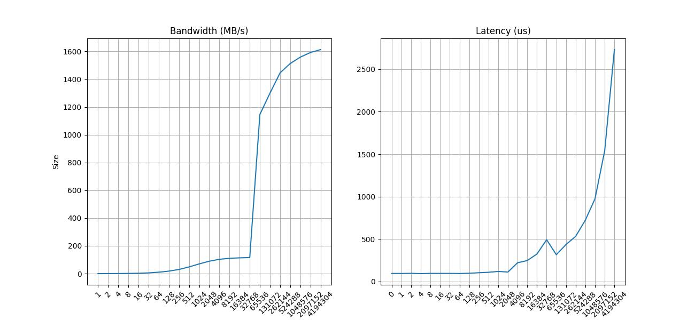
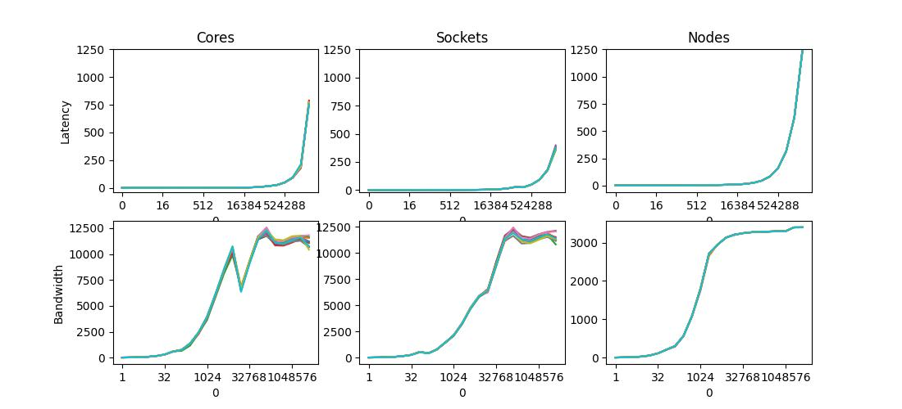

<<<<<<< HEAD
# 01 Submission Moritz Perschke

## Job script to run `/bin/hostname`
=======
# Submission 01 Moritz Perschke

## Exercise 1
### Task 1

*Study how to submit jobs in SLURM, how to check their state and how to cancel them.*

This was mentioned in the proseminar:
  - to submit a job, use `squeue`
  - to check on a jobs status, the alias `squ` can be used on the cluster, to show the jobs of `$USER`
  - to cancel, use `scancel`

### Task 2

*Prepare a submission script that starts an arbitrary executable, e.g. `/bin/hostname`*

>>>>>>> e9e2f141889642c2d4c51515c2bd96f5e8f9b5b7
```bash
#!/bin/bash

# Execute job in the partition "lva" unless you have special requirements.
#SBATCH --partition=lva
# Name your job to be able to identify it later
#SBATCH --job-name test
# Redirect output stream to this file
#SBATCH --output=output.log
# Maximum number of tasks (=processes) to start in total
#SBATCH --ntasks=1
# Maximum number of tasks (=processes) to start per node
#SBATCH --ntasks-per-node=1
# Enforce exclusive node allocation, do not share with other jobs
#SBATCH --exclusive

/bin/hostname
```
<<<<<<< HEAD
=======

The example script does this already.

The output of the script (in output.log in the current dir) is as follows:
```
n001.intern.lcc3.intra.uibk.ac.at
```

### Task 3

*In your opionion, what are the 5 most important parameters available when submitting a job and why? What are possible settings of these parameters, and what effect do they have?*

I think the example script already includes some of the most important/useful parameters.
For example exlusive node allocation, number of tasks and the job name, which I see myself using for almost all jobs in this PS.

I think the `--mem-per-cpu` or `--mem-per-gpu` parameter is one of the most important parameters, which is not part of the example script.
It might be the case that I know the minimum memory requirement of my job beforehand, and I know that some nodes do not have enough, while others do.
In this case this parameter is basically required in order to ensure that my job does not fail.

For a job that reads data from a file, such as measurements, the `--input` parameter is also essential.
This parameter connects the scripts `stdin` to this file.

On a larger supercomputer, used by multiple projects at the same time, the `--clusters` parameter might be very important.
This parameter specifies the cluster to be used by the job, which could come in very handy in a larger supercomputer.
Using this parameter different projects can be assigned different clusters for example, which allows for better sharing of a supercomputer that is meant to be used by different projects at the same time.

For tasks that have specific requirements, the `--constraint` or `-C` parameter can ensure the job only runs on nodes with a specific label.
These labels are assigned by the administrator.
Examples mentioned in the documentation include `intel` or `amd` (for vendor specific cpus), `graphics` (for a node with a gpu) or a specific rack.
So if the supercomputer has nodes with an without gpus, and the job requires a gpu, this parameter can ensure the usage of nodes that can adequately handle the job.

There are also a few parameters that deal with 'accounting'.
For example `--account`, which specifies the account to be charged, might be *very* important on an actual scientific cluster.
For the lcc3, which by now only exists for teaching purposes (as far as I understand it), I don't see the importance.
Noone pays on the lcc3 for resources used, so why woul I want to change the account that gets charged.

### Task 4

*How do you run your program in parallel? What environment setup is required?*

This was also discussed in the proseminar.

```bash
#!/bin/bash

# Execute job in the partition "lva" unless you have special requirements.
#SBATCH --partition=lva
# Name your job to be able to identify it later
#SBATCH --job-name test
# Redirect output stream to this file
#SBATCH --output=output.log
# Maximum number of tasks (=processes) to start in total
#SBATCH --ntasks=X
# Maximum number of tasks (=processes) to start per node
#SBATCH --ntasks-per-node=1
# Enforce exclusive node allocation, do not share with other jobs
#SBATCH --exclusive

module load openmpi/4.1.4-gcc-12.2.0-6gebvs6
mpiexec -n $SLURM_NTASKS /bin/hostname
```

By loading the mpi module and using it to execute the command in parallel, the "program" is parallelized.
Now by increasing the `--ntasks=...` parameter, the number of `/bin/hostname` calls can be changed, as every tasks does so.

e.g X=3:

```
n001.intern.lcc3.intra.uibk.ac.at
n002.intern.lcc3.intra.uibk.ac.at
n003.intern.lcc3.intra.uibk.ac.at
```

X=7:

```
n001.intern.lcc3.intra.uibk.ac.at
n004.intern.lcc3.intra.uibk.ac.at
n002.intern.lcc3.intra.uibk.ac.at
n003.intern.lcc3.intra.uibk.ac.at
n005.intern.lcc3.intra.uibk.ac.at
n007.intern.lcc3.intra.uibk.ac.at
n006.intern.lcc3.intra.uibk.ac.at
```

This example also shows that the calls are not happening one after the other quite nicely.


## Exercise 2
When I started this exercise, some people had already entered values into the spreadsheet.
At first I used the script above to run the benchmarks, but my times were off by a noticable margin compared to even the highest in the spreadsheet.
I then played around with parameters and asked ChatGPT some things that I didn't understand.
After a while I realized that instead of using `sbatch` flags I could use `mpiexec` flags, wich in combination a more current gcc produced satisfying results.



The used script looks like this:
```
#!/bin/bash

#SBATCH --partition=lva
#SBATCH --job-name osu_benchmark
#SBATCH --exclusive
#SBATCH --error=errors/cores.log
#SBATCH --output=bandwidth/cores.log
#SBATCH --ntasks=2

module load openmpi/3.1.6-gcc-12.2.0-d2gmn55
mpiexec -n $SLURM_NTASKS ./osu_bw
```

In order to run the benchmarks on different cores, sockets or nodes, the `--map-by <unit>` can be used.

```
#!/bin/bash

#SBATCH --partition=lva
#SBATCH --job-name osu_benchmark
#SBATCH --exclusive
#SBATCH --error=errors/nodes.log
#SBATCH --output=bandwidth/nodes.log
#SBATCH --ntasks=2

module load openmpi/3.1.6-gcc-12.2.0-d2gmn55
mpiexec --report-bindings --map-by node -n 2 ../osu_bw
```

To verify the correct placement, the `--report-bindings` option is used, which causes the bindings to be written to stderr.


I am not quite sure why the latency between sockets should be lower for a large packetsize.
I assume this is a problem with my benchmark and is not representative of the actual latency.

To measure the consistency of these measurements, I submitted the same job ten times.



Judging by the graph, these measurements appear quite stable
>>>>>>> e9e2f141889642c2d4c51515c2bd96f5e8f9b5b7
